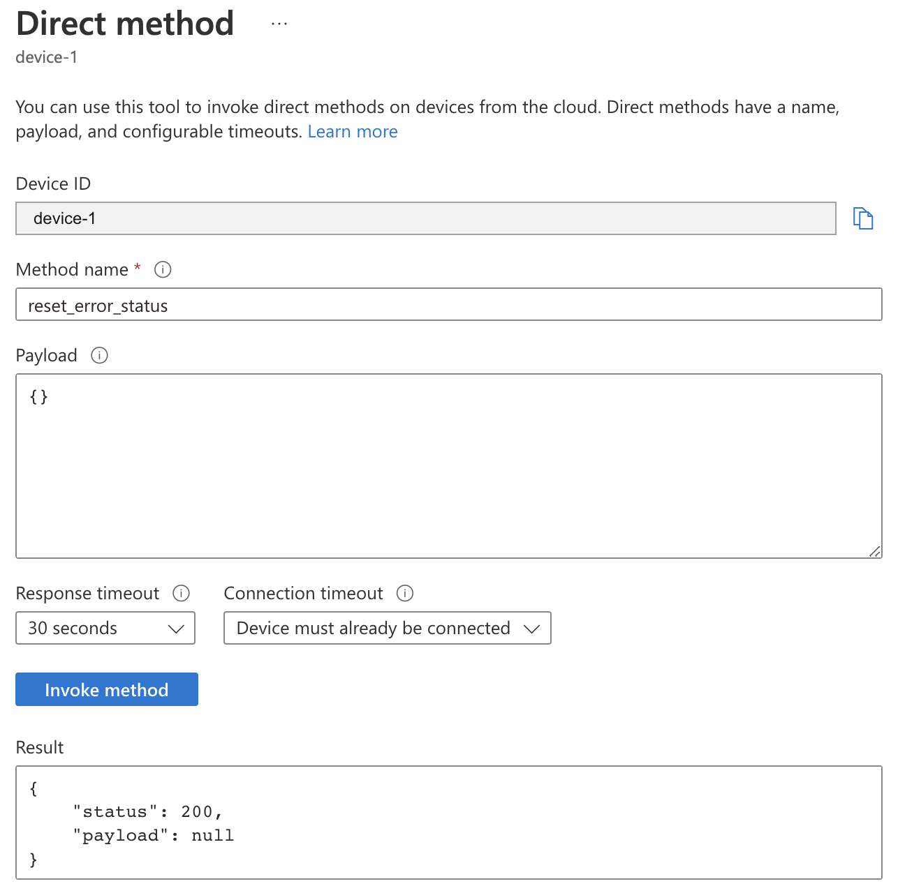

# Industrial IoT
### Case study - azure
### Repozytorium:
[https://github.com/malklep/projekt-iot](https://github.com/malklep/projekt-iot)
### Projekt został stworzony przez: [Małgorzata Klepczarek](https://github.com/malklep)

## Połączenie z urządzeniem (serwer OPC UA)
Do połączenia z serwerem została wykorzystana biblioteka (klient OPC UA) **asyncua**, przy jej użyciu została stworzona instancja klasy Client, z podanym adresem serwera zawierającym się w pliku konfiguracyjnym.

Przykładowa konfiguracja:
```ini
[OPCUA]
server_url = opc.tcp://10.211.55.3:4840/
```

Po połączeniu z serwerem zostają pobrane informacje na temat istniejących urządzeń. Dane są odświeżane co jedną sekundę.

```python
async with Client(config.server_url) as client:
  objects = client.get_node('i=85')

  for child in await objects.get_children():
      child_name = await child.read_browse_name()
      if child_name.Name != 'Server':
          connection_string = config.get_device_config(child_name.Name)
          agent = Agent.init(
              device=Device.init(device=child, client=client),
              connection_string=connection_string
          )

          subscription = await client.create_subscription(500, agent)
          await subscription.subscribe_data_change(
            await agent.subscribed_properties
          )

          agents.append(agent)
          subscriptions.append(subscription)

  while True:
      for agent in agents:
          await asyncio.gather(*agent.tasks)
      await asyncio.sleep(1)
```

## Konfiguracja agenta
Proces konfiguracja agenta występuje po połaczeniu się z serwerem OPC UA i pobraniu listy dostępnych urządzeń. Dla każdego urządzenia sprawdzane jest czy w pliku konfiguracyjnym występuje jego `connection string` w przypadku braku takiej informacji użytkownik jest proszony o jego podanie.

Przykładowy plik konfiguracyjny:
```ini
[DEVICES]
device 1 = connection string
```

Po pobraniu informacji o connection stringu, tworzona jest instancja klasy Agent do której przekazywana jest instancja klasy Device oraz Client

```python
agent = Agent.init(
    device=Device.init(device=child, client=client),
    connection_string=connection_string
)
```

`child` - obiekt Node pochodzący z biblioteki **asyncua**\
`client` - instancja klasy Client z biblioteki **asyncua**

## Wiadomości D2C

Agent wysyła do IoT Hub informacje telemetryczne oraz informacje o zachodzących błędach. Wiadomości te są wysyłane co 1 sekundę.

Przykładowa wiadomość zawierająca dane telemetryczne:
```json
{
  "body": {
    "ProductionStatus": 1,
    "WorkorderId": "e42c7d93-cb52-4d03-906e-ee120d5c17d5",
    "GoodCount": 23,
    "BadCount": 5,
    "Temperature": 69.48632652446892,
    "message_type": "telemetry"
  },
  "enqueuedTime": "Mon Dec 26 2022 16:39:16 GMT+0100 (Central European Standard Time)",
  "properties": {}
}
```

Przykładowa wiadomość zawierająca informacje o wystąpieniu błędu:
```json
{
  "body": {
    "device_error": 2,
    "message_type": "event"
  },
  "enqueuedTime": "Mon Dec 26 2022 16:39:15 GMT+0100 (Central European Standard Time)",
  "properties": {}
}
```

## Device Twin
W device twin są przechowywane następujące wartości: `Desired Production Rate`, `Reported Production Rate`, `Last Maintanance Date`, `Last Error Date` oraz `Device Error`

Przykładowy device twin:
```json
{
	"deviceId": "device-1",
	"etag": "AAAAAAAAAAI=",
	"deviceEtag": "NDM5MTgxNDMw",
	"status": "enabled",
	"statusUpdateTime": "0001-01-01T00:00:00Z",
	"connectionState": "Disconnected",
	"lastActivityTime": "2022-12-26T15:39:26.1805478Z",
	"cloudToDeviceMessageCount": 0,
	"authenticationType": "sas",
	"x509Thumbprint": {
		"primaryThumbprint": null,
		"secondaryThumbprint": null
	},
	"modelId": "",
	"version": 82,
	"properties": {
		"desired": {
			"production_rate": 33,
			"$metadata": {
				"$lastUpdated": "2022-12-26T00:45:18.8536385Z",
				"$lastUpdatedVersion": 2,
				"production_rate": {
					"$lastUpdated": "2022-12-26T00:45:18.8536385Z",
					"$lastUpdatedVersion": 2
				}
			},
			"$version": 2
		},
		"reported": {
			"last_maintenance_date": "2022-12-26T01:44:48.225082",
			"device_error": 4,
			"production_rate": 40,
			"last_error_date": "2022-12-26T16:39:18.691039",
			"$metadata": {
				"$lastUpdated": "2022-12-26T15:39:19.0085962Z",
				"last_maintenance_date": {
					"$lastUpdated": "2022-12-26T00:44:48.2794544Z"
				},
				"device_error": {
					"$lastUpdated": "2022-12-26T15:39:19.0085962Z"
				},
				"production_rate": {
					"$lastUpdated": "2022-12-26T15:39:10.4616259Z"
				},
				"last_error_date": {
					"$lastUpdated": "2022-12-26T15:39:18.7117403Z"
				}
			},
			"$version": 80
		}
	},
	"capabilities": {
		"iotEdge": false
	}
}
```

## Direct Methods
Agent posiada zaimplementowaną obsługę 3 metod:
- emergency_stop
- reset_error_status
- maintenance_done

Żadna z metod do wywołania nie potrzebuje podania parametrów.

Przykładowe wywołanie metody `emergency_stop`:


Przykładowe wywołanie metody `reset_error_status`:


Przykładowe wywołanie metody `maintenance_done`:


## Implementacja kalkulacji i logiki biznesowej

### Kalkulacje danych

Do zaimplementowania kalkulacji został wykorzystany Azure Stream Analytics, którego źródłem informacji są dane telemetryczne przesyłane D2C przez agenta danego urządzenia.

Kalkulacje są wykonywane przy użyciu poniższych kwerend:
```sql
-- production per workorderId
SELECT
    WorkorderId,
    SUM(GoodCount) AS GoodCountSum,
    SUM(BadCount) AS BadCountSum,
    System.Timestamp() AS WindowEndTime
INTO [asa-production-counts]
FROM [asa-in-iothub] TIMESTAMP BY EventEnqueuedUtcTime
GROUP BY
    WorkorderId, TumblingWindow(minute , 15)

-- production kpi
SELECT
    (SUM(GoodCount) / (SUM(GoodCount) + SUM(BadCount))) AS kpi,
    System.Timestamp() AS WindowEndTime
INTO [asa-kpi]
FROM [asa-in-iothub] TIMESTAMP BY EventEnqueuedUtcTime
GROUP BY
    TumblingWindow(minute , 15)

-- min, average & max of temperature
SELECT
    WorkorderId,
    AVG(Temperature) AS AverageTemperature,
    MIN(Temperature) AS MinTemperature,
    MAX(Temperature) AS MaxTemperature,
    System.Timestamp() AS WindowEndTime
INTO [asa-machine-temperatures]
FROM [asa-in-iothub] TIMESTAMP BY EventEnqueuedUtcTime
GROUP BY
    WorkorderId, TumblingWindow(minute , 5)

-- errors in 15 minutes window
SELECT ih.IoTHub.ConnectionDeviceId, COUNT(message_type) as errors
INTO [asa-error-per-machine]
FROM [asa-in-iothub] ih TIMESTAMP by EventEnqueuedUtcTime
WHERE message_type = 'event'
GROUP BY
    message_type, ih.IoTHub.ConnectionDeviceId, TumblingWindow(minute , 15)
HAVING count(message_type) > 3
```

Wyniki kwerend są natomiast zapisywane w Blob Containerach.

### Logika biznesowa

Do obliczeń danych i wywołania logiki biznesowej użyte zostały następujące usługi:
- Azure Stream Analytics
- Azure Functions

Do obliczenia danych potrzebnych to monitorowania i wywołania logiki biznesowej zostały wykorzystane następujące kwerendy:

```sql
--- emergency stop trigger
SELECT ih.IoTHub.ConnectionDeviceId, COUNT(message_type) as errors
INTO [asa-emergency-stop-trigger]
FROM [asa-in-iothub] ih TIMESTAMP by EventEnqueuedUtcTime
WHERE message_type = 'event'
GROUP BY
    message_type, ih.IoTHub.ConnectionDeviceId, TumblingWindow(minute , 15)

-- production kpi trigger
SELECT
    (SUM(GoodCount) / (SUM(GoodCount) + SUM(BadCount))) AS kpi,
    System.Timestamp() AS WindowEndTime
INTO [asa-production-kpi-trigger]
FROM [asa-in-iothub] TIMESTAMP BY EventEnqueuedUtcTime
GROUP BY
    TumblingWindow(minute , 15)
```

Kierują one swoje wyniki do Azure Functions, które to przetwarzają te dane i za pomocą C2D wywołują odpowiednie metody w przypadku zajścia danych warunków.